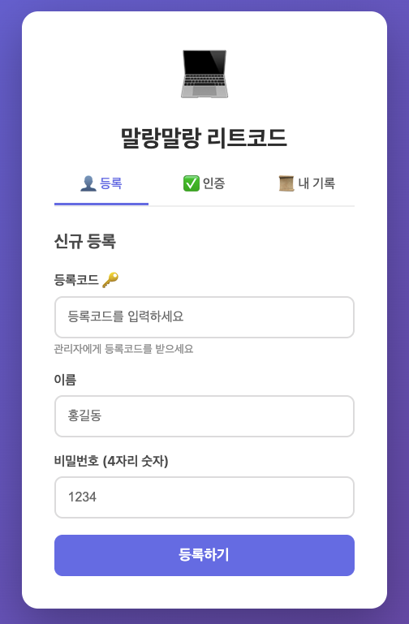
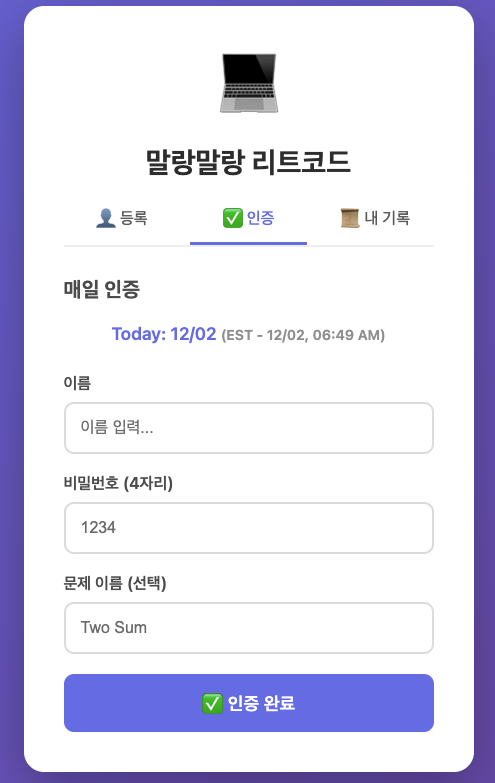
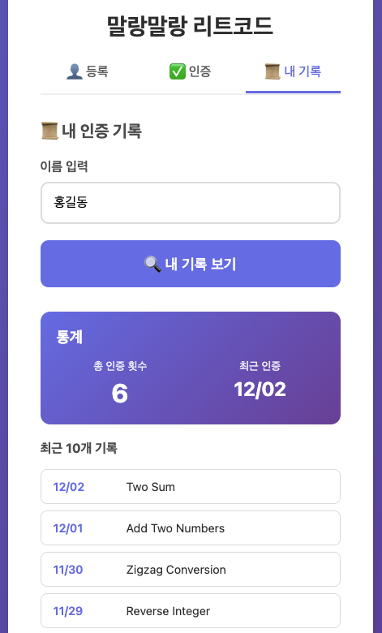
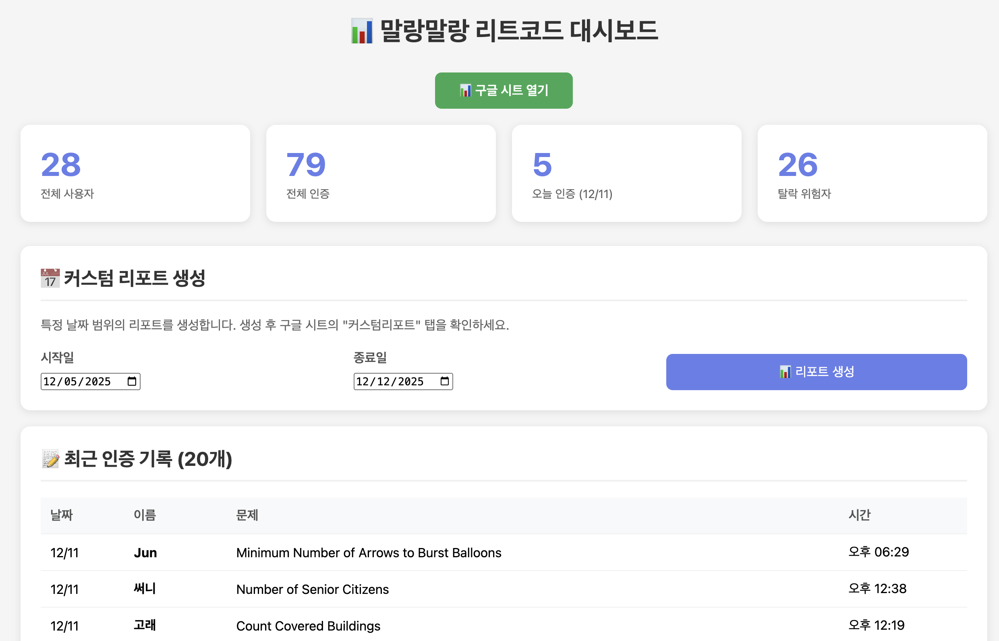
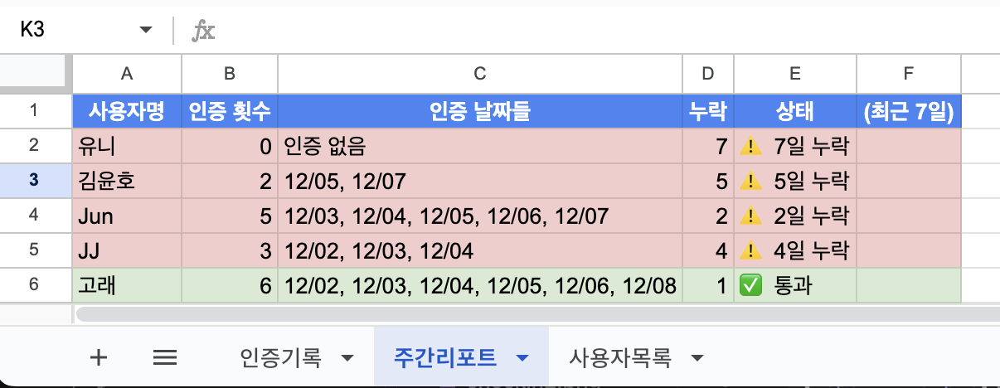

# 🧠 말랑말랑 리트코드 - Big Brain LeetCode Challenge Tracker
~~(Cursor와 함께 개발하는 내내 닌텐도 게임 말랑말랑 두뇌교실이 떠오르길래!)~~

매일 리트코드 문제를 풀고 인증하는 스터디 그룹을 위한 **간편한 체크인 시스템**입니다.  
Google Apps Script와 Google Sheets를 활용해 별도의 서버 없이 무료로 운영할 수 있으며,
약간만 수정하면 리트코드 외에도 다양한 데일리 인증 챌린지에 맞춰 여러 그룹에서 쉽게 활용할 수 있습니다.

🌐 말랑말랑 리트코드 [[유저용]](https://bigbrainlc.netlify.app/) [[관리자용]](https://bigbrainlc.netlify.app/admin.html)



---

## ✨ 주요 기능

### 👤 사용자 기능
- **보안 회원가입**: 등록코드로 스터디 그룹만 가입 가능 🔐
- **간편 등록**: 등록코드 + 이름 + 비밀번호로 즉시 가입
- **일일 인증**: 날짜와 문제 이름을 입력하여 인증
- **실시간 통계**: 총 인증 횟수와 마지막 인증일 확인
- **인증 히스토리**: 최근 10개 인증 기록 조회

<p align="center">
  
  
  
</p>

### 🔐 관리자 대시보드
- **실시간 통계**: 전체 사용자, 전체/오늘 인증, 탈락 위험자 수
- **사용자 관리**: 전체 사용자 목록 및 삭제 기능
- **최근 활동**: 최근 20개 인증 기록 실시간 확인
- **커스텀 리포트**: 원하는 날짜 범위의 리포트 생성
- **구글 시트 연동**: 원본 데이터 바로 확인


*관리자 대시보드*

### 📊 자동 리포트
- **주간 리포트**: 매주 자동 생성 (스케줄 설정 가능)
- **탈락자 추적**: 2일 이상 누락 시 자동 표시
- **커스텀 기간 리포트**: 3일/7일/14일/30일 또는 원하는 기간 설정


*주간 리포트 예시*

## 🚀 빠른 시작

<details>
<summary>📖 자세히 보기</summary>

### 1️⃣ Google Sheets 설정

1. [Google Sheets](https://sheets.google.com) 새 스프레드시트 생성
2. **확장 프로그램** > **Apps Script** 클릭
3. `backend/Code.gs` 내용 전체 복사 & 붙여넣기
4. **⚠️ 중요: 9번째 줄의 등록코드를 변경하세요!**
   ```javascript
   const REGISTER_CODE = 'YOUR_REGISTER_CODE_HERE';  // 원하는 코드로 변경!
   ```
5. **저장** 후 **배포** > **새 배포**
   - 유형: **웹 앱**
   - 액세스 권한: **모든 사용자**
6. 배포 URL 복사 (예: `https://script.google.com/macros/s/ABC.../exec`)

### 2️⃣ 로컬 테스트 설정 (선택사항)

로컬에서 테스트하려면 `config.js` 파일을 생성하세요:

```bash
# 프로젝트 루트에서
cp config.example.js config.js
```

이후 `config.js`를 실제 값으로 수정:
```javascript
const CONFIG = {
  SCRIPT_URL: 'https://script.google.com/macros/s/YOUR_SCRIPT_ID/exec',
  REGISTER_CODE: 'your_registration_code',
  ADMIN_PASSWORD: 'your_secure_password',
  SHEET_URL: 'https://docs.google.com/spreadsheets/d/YOUR_SHEET_ID/edit'
};
```

> 💡 **참고**: 
> - 로컬 테스트용입니다 (`.gitignore`에 포함됨)
> - Netlify 배포 시에는 환경 변수를 사용하므로 이 파일이 필요 없습니다

#### 백엔드 등록코드 설정
Google Apps Script 에디터에서 `backend/Code.gs` 파일 9번째 줄의 `REGISTER_CODE`를 설정하세요:
```javascript
// 9번째 줄
const REGISTER_CODE = 'your_registration_code';
```

### 3️⃣ 배포

#### Netlify로 배포 (권장 ⭐)

1. **GitHub 저장소에 푸시**
   ```bash
   git add .
   git commit -m "Initial commit"
   git push origin main
   ```

2. **Netlify 배포**
   - [Netlify](https://netlify.com) 로그인
   - **Add new site** > **Import an existing project**
   - GitHub 저장소 선택

3. **환경 변수 설정** (중요! 🔐)
   
   Netlify Dashboard에서:
   - **Site settings** > **Environment variables** 클릭
   - 다음 4개 변수 추가:
   
   | 변수명 | 값 |
   |--------|-----|
   | `SCRIPT_URL` | Google Apps Script 배포 URL |
   | `REGISTER_CODE` | 등록코드 |
   | `ADMIN_PASSWORD` | 관리자 비밀번호 |
   | `SHEET_URL` | 구글 시트 URL |
   
   이 환경 변수들은 빌드 시 `build.sh`에 의해 `config.js`로 변환됩니다.

4. **배포 트리거**
   - **Deploys** 탭 > **Trigger deploy** > **Deploy site** 클릭
   - 빌드가 완료될 때까지 대기 (약 30초)

5. **완료!**
   - `https://your-site-name.netlify.app` 에서 확인
   - 환경 변수는 안전하게 관리되며 GitHub에 노출되지 않음 ✅
   - 관리자 페이지: `https://your-site-name.netlify.app/admin.html`

#### GitHub Pages로 배포 (선택사항)

<details>
<summary>GitHub Pages 사용하려면 클릭</summary>

1. GitHub 저장소 → **Settings** → **Pages**
2. **Source**: `main` branch, `/ (root)` 선택
3. **Save**
4. `https://YOUR_USERNAME.github.io/REPO_NAME/` 에서 확인

⚠️ **주의**: `config.js`를 GitHub에 올려야 하므로 비밀번호가 공개됩니다!

</details>

</details>


## 📁 프로젝트 구조 및 기술 스택

<details>
<summary>📖 자세히 보기</summary>

### 📁 프로젝트 구조

```
bigbrain-tracker/
├── backend/
│   └── Code.gs              # Google Apps Script (서버 로직)
├── frontend/                # 배포 디렉토리 (Netlify가 이 폴더를 배포)
│   ├── index.html           # 사용자 페이지
│   ├── admin.html           # 관리자 페이지
│   └── config.js            # 빌드 시 자동 생성 (gitignore됨)
├── screenshots/             # README용 스크린샷
├── config.example.js        # 설정 템플릿 (환경 변수 예시)
├── build.sh                 # Netlify 빌드 스크립트 (frontend/config.js 생성)
├── netlify.toml             # Netlify 배포 설정
├── .gitignore               # Git 제외 파일
├── LICENSE                  # MIT 라이센스
├── CONTRIBUTING.md          # 기여 가이드
└── README.md                # 프로젝트 문서
```

### 파일 구조 설명

- **`frontend/`**: 
  - 소스 파일이 있는 디렉토리
  - Netlify가 이 폴더를 배포 (`publish = "frontend"`)
  - 빌드 시 `config.js`가 자동 생성됨
- **`build.sh`**: Netlify 빌드 시 환경 변수로부터 `frontend/config.js` 자동 생성
- **`netlify.toml`**: Netlify 빌드 설정 (환경 변수 사용)

## 🛠 기술 스택

- **Backend**: Google Apps Script (JavaScript)
- **Database**: Google Sheets
- **Frontend**: Vanilla HTML/CSS/JavaScript
- **Hosting**: Netlify (권장)

## 🌍 타임존 독립성

이 시스템은 **타임존 독립적**으로 설계되었습니다:
- 각 사용자가 자신의 로컬 타임존에서 날짜 선택
- 날짜를 **문자열**(MM/DD)로 저장하여 타임존 이슈 방지
- 한국/미국/유럽 어디서든 동일하게 작동

</details>

## 📊 Google Sheets 데이터 구조

<details>
<summary>📖 자세히 보기</summary>

배포 후 자동으로 3개의 시트가 생성됩니다:

### 1. 사용자목록
| 사용자명 | 비밀번호 | 등록일시 |
|---------|---------|---------|
| 홍길동 | '1234 | 2024-12-02T... |

### 2. 인증기록
| 타임스탬프 | 날짜 | 사용자명 | 문제명 |
|-----------|------|---------|--------|
| 2024-12-02T... | '12/02 | 홍길동 | 1. Two Sum |

### 3. 주간리포트 (자동 생성)
| 사용자명 | 인증 횟수 | 인증 날짜들 | 누락 | 상태 |
|---------|----------|-----------|------|------|
| 홍길동 | 6 | 11/25, 11/26... | 1 | ✅ 통과 |

## ⚙️ 고급 설정

### 자동 주간 리포트 설정

Apps Script 에디터에서 함수 실행:
```javascript
setupWeeklyTrigger()  // 매주 일요일 밤 11:59 PM (PST)
```

### 커스텀 기간 리포트 생성

Apps Script에서 직접 실행 가능:
```javascript
generate3DayReport()    // 최근 3일
generate7DayReport()    // 최근 7일 (기본)
generate14DayReport()   // 최근 14일
generate30DayReport()   // 최근 30일
```

또는 관리자 대시보드에서 원하는 날짜 범위 선택하여 커스텀리포트 생성 가능

</details>

## 🔒 보안

<details>
<summary>📖 자세히 보기</summary>

### 접근 제어
- **등록코드**: 스터디 그룹 멤버만 가입 가능하도록 등록코드 필수 🔐
- **이중 검증**: 프론트엔드와 백엔드 모두에서 등록코드 검증
- 비밀번호는 Google Sheets에 평문 저장 (개인 스터디용)

### 민감한 정보 관리 (Netlify 환경 변수)

**Netlify 배포 시**:
- ✅ 민감한 정보는 **Netlify 환경 변수**에 저장
- ✅ GitHub에는 절대 올라가지 않음
- ✅ `build.sh`가 빌드 타임에만 `config.js` 생성
- ✅ Netlify Dashboard에서만 관리 가능

**GitHub에 올라가는 것**:
- `config.example.js` - 템플릿만 (실제 값 없음)
- `build.sh` - 빌드 스크립트 (환경 변수 사용)
- `netlify.toml` - 빌드 설정 (환경 변수 이름만)
- `Code.gs` - 플레이스홀더만 (`YOUR_REGISTER_CODE_HERE`)

**GitHub에 올라가지 않는 것**:
- `config.js` - 로컬 테스트용 (`.gitignore`에 포함)
- 실제 등록코드, 비밀번호, URL - Netlify 환경 변수에만 존재

### 등록코드 관리 팁
- 정기적으로 등록코드 변경 (Netlify Dashboard에서 쉽게 변경)
- 외부 공개 금지 (스터디 멤버에게만 비공개 공유)
- 탈퇴자 발생 시 등록코드 변경 권장

> 💡 **프로덕션 사용 시**: 적절한 암호화 및 인증 시스템 추가 권장

</details>

## 📝 사용 시나리오

<details>
<summary>📖 자세히 보기</summary>

### 스터디 그룹 운영자
1. 시스템 배포 (5분)
2. 등록코드 설정 (프론트엔드 + 백엔드)
3. 멤버들에게 **URL + 등록코드** 비공개로 공유
4. 매주 자동 리포트 확인
5. 탈락 위험자 체크 및 독려

### 스터디 참여자
1. 운영자에게 등록코드 받기
2. 회원가입 (등록코드 + 이름 + 비밀번호)
3. 매일 문제 풀고 인증
4. 본인 통계 확인
5. 꾸준히 참여!

</details>

## 🤝 기여

버그 리포트나 기능 제안은 Issues에 등록해주세요!

## 📄 라이센스

MIT License - 자유롭게 사용하세요!

## 📞 문의

프로젝트 관련 문의나 질문은 Issues를 통해 남겨주세요.

<div align="center">

**⭐ 이 프로젝트가 도움이 되었다면 Star를 눌러주세요!**

---

### 👨‍💻 만든 사람

**Yooni Choi** ([@yoonichoi](https://github.com/yoonichoi))

Made with ❤️ for LeetCode enthusiasts

Copyright © 2025 Yooni Choi. All rights reserved.

</div>

